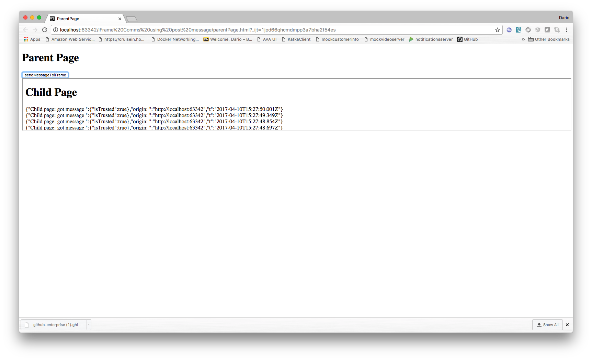

# iFrame comms using Post Message:

Tech demo to understand how to communicate with an iFrame by using the "postMessage" API.



1) parentPage.html loads child.html by using an iframe.

2) parentPage sends "Hello" using:
 
```javascript
window.postMessage();
```

3) child receives the message by using:

```javascript
window.addEventListener("message", receiveMessage, false);
```

4) child logs the message.